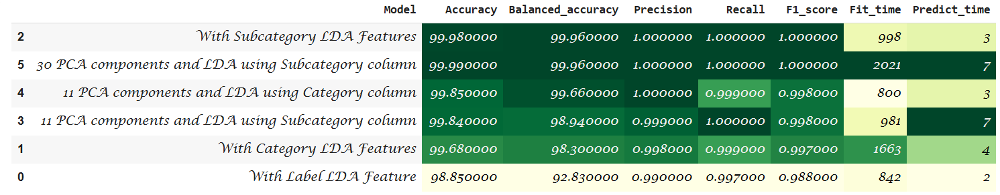
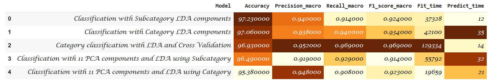

# Optimized-IoT-Intrusion-Classification-using-PCA-LDA

## 📌 Introduction
This project addresses the challenges of high-dimensional IoT traffic data for Intrusion Detection Systems (IDS). Using the IoTID20 dataset, it explores dimensionality reduction techniques (PCA, LDA, and hybrid PCA+LDA) to improve classification accuracy while reducing computational cost for real-world IoT deployment.

...

## 0️⃣|1️⃣ Binary Classification Results

**Model Explanations:**

- **Label LDA Feature** → Uses only the binary label (Normal/Malicious) as a discriminator. Simplest reduction, but loses finer details.  
- **Category LDA Features** → Groups attacks into broader categories (e.g., DoS, Probe). Captures more structure than Label-based.  
- **Subcategory LDA Features** → Uses detailed subcategories of attacks, giving more discriminative power.  
- **PCA + LDA (Category/Subcategory)** → First reduces dimensionality with PCA, then applies LDA. Helps balance speed and accuracy.  

**Model Performance Comparison (Binary Classification):**  

  

✅ **Best Models (Binary):**  
- **30 PCA + LDA (Subcategory)** → Highest accuracy (**99.99%**)  
- **Subcategory LDA Features** → Best trade-off between accuracy and speed (fit: 998 ms, predict: 3 ms)  

---

## 🔢 Multi-Class Classification Results

**Model Explanations:**

- **Category LDA components** → Projects data into fewer dimensions based on attack categories (e.g., DoS, Probe, R2L).  
- **Subcategory LDA components** → Uses finer-grained attack subcategories, improving separability between different attack types.  
- **PCA + LDA (Category/Subcategory)** → Combines PCA (to reduce redundancy) and LDA (to enhance class separation).  
- **Category LDA + Cross Validation** → Validates generalization performance across multiple folds, more robust but slower.  

**Model Performance Comparison (Multi-Class Classification):**  

  

✅ **Best Models (Multi-Class):**  
- **Subcategory LDA components** → Best overall F1-score (**0.996**) with efficient training.  
- **Category LDA + Cross Validation** → Excellent recall, but computationally expensive.
